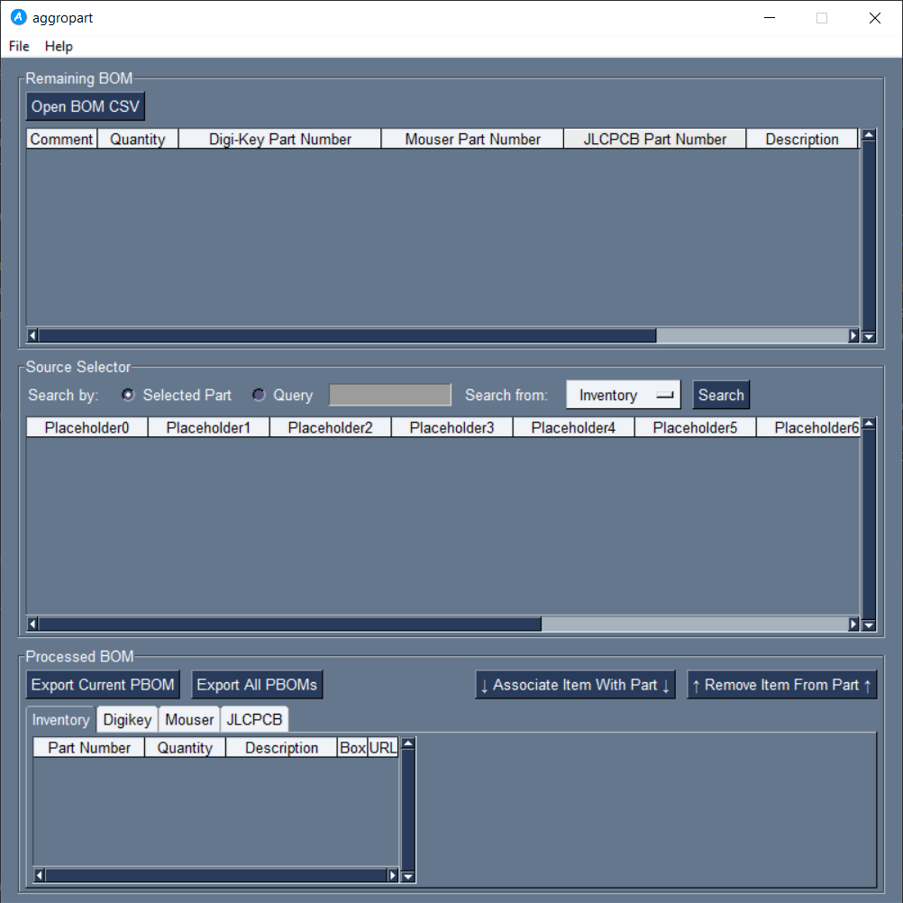
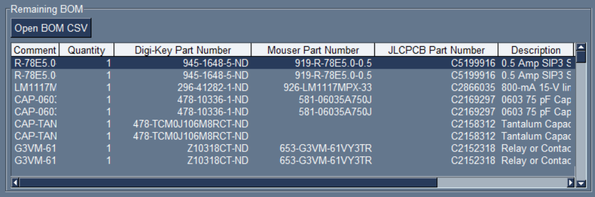
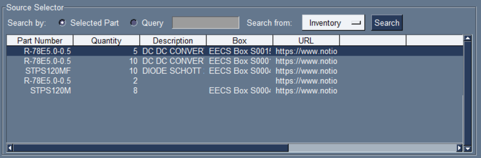
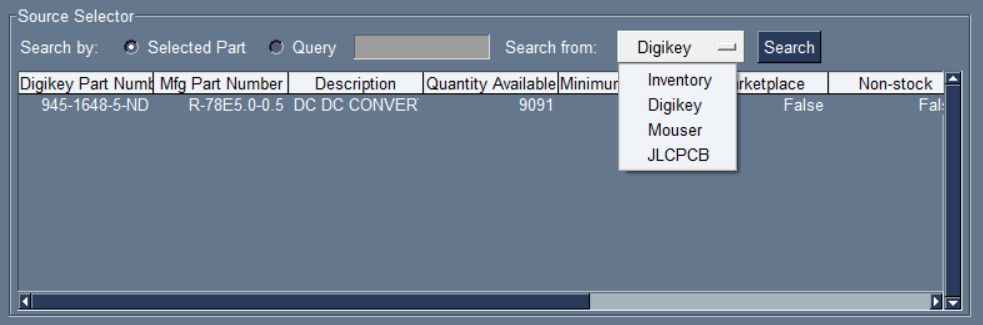
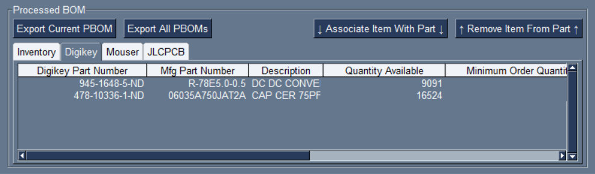

# aggropart

A utility program to automate the selection of 
parts from an Altium BOM file.

## Usage
aggropart aims to automate the process of turning an Altium BOM 
into a series of purchases or inventory acquisitions.

To accomplish this, the user first opens the main GUI (`python3 gui.py`)

On the GUI there are three stages which each BOM item progresses through:
- Remaining BOM (RBOM)
- Source Selector (SSEL)
- Processed BOM (PBOM)

### RBOM
Altium BOMs are first loaded from a CSV file (CSV only, no JSON, etc)
by clicking the "Open BOM CSV" button. The BOM is then loaded into
the RBOM stage. All items in the BOM are displayed.

### SSEL
Once loaded, the user may start to search for parts which match
each BOM entry. Possible sources from which to search are:
EECS Inventory, Digikey, Mouser, or JLCPCB (assembly service).
This source can be selected using the "Search from" dropdown menu.

Searches by default correspond to the part selected in the RBOM
section (the correct type of part number will be used automatically -
for example 'Digi-Key Part Number' for Digikey). However, by
switching to "Query" the user can input any keyword, which will
then be searched instead.

Note that each search requires specific configutation and API
perimssions. See the setup/installation section for more details.

### PBOM
Once the user has selected both an item in the RBOM and SSEL stages
(meaning a BOM item and a source to acquire it from), they can then
associate the two in the PBOM stage.

To do this, the user should click "Associate Item With Part", which
will add the acquisition data to its associated PBOM table. If that
association is no longer desired, the user can click
"Remove Item From Part", which will perform the opposite operation
and append the BOM item back to the RBOM section.

Once finished, the user can export this data to CSV format by
clicking "Export All PBOMs". This will export one CSV for each PBOM,
stored under the filepath "out/<src>_bom.csv". To export only the
current PBOM, click "Export Current PBOM" instead.

## Installation
1. Install Python dependencies with `pip`:
> python3 -m pip install -r requirements.txt
2. Copy `.env.template` to `.env`
3. Populate `.env` with API keys (no string delimiters)
   1. If you are a member of FEB, ask EECS admin for keys first. 
      You will not need to do the steps below.
   2. For Digikey: https://developer.digikey.com/get_started
   3. DIGIKEY_STORAGE_PATH should be "cache/"
   4. For Mouser: https://www.mouser.com/api-search/
   5. For Notion (Inventory): https://developers.notion.com/
   6. JLC does not have a public API
4. Digikey will ask for OAuth (login) authentication the first 
   time the Digikey search functionality is used.
5. Run the GUI with `python3 gui.py`